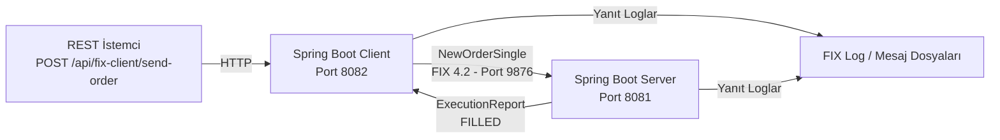

# 🚀 FIX Protocol 4.2 Örneği - Spring Boot + QuickFIX/J

<div align="center">
  <h3>Proje Mimarisi</h3>



</div>

- ✅ **FIX Protocol 4.2 ile iki yönlü iletişim (Initiator / Acceptor)**
- ✅ **NewOrderSingle gönderimine karşılık ExecutionReport dönüşü**
- ✅ **QuickFIX/J 3.0.0 ile Spring Boot entegrasyonu**
- ✅ **Docker Compose ile tek komutla çalıştırma**
- ✅ **Yapılandırılabilir FIX oturumu (SenderCompID, TargetCompID, HeartbeatInterval)**

<br>

Projede Kullanılan Teknolojiler:

[](https://www.java.com/)
[](https://spring.io/projects/spring-boot)
[](https://gradle.org/)
[](https://www.quickfixj.org/)
[](https://docs.docker.com/compose/)

<br>

## 📌 Bu Proje Nedir?

**FIX Protocol 4.2 Örneği**, finansal sistemlerde yaygın olarak kullanılan FIX (Financial Information eXchange) protokolünün Spring Boot ve QuickFIX/J kütüphanesiyle nasıl uygulanacağını gösteren tam kapsamlı bir örnektir.

**Ne Yapar:**

- İstemci (Client), sunucuya (Server) FIX 4.2 protokolü üzerinden `NewOrderSingle` mesajı gönderir
- Sunucu, gelen emri işler ve `ExecutionReport` mesajıyla yanıt verir
- İstemciye ait REST endpoint (`POST /api/fix-client/send-order`) üzerinden emir tetiklenebilir
- Tüm FIX oturum mesajları ve logları `target/fix/` dizininde saklanır

<br>

## 🧠 Nasıl Çalışır?

**Akış:**

```text
1) REST istemcisi POST /api/fix-client/send-order isteği gönderir
2) FixProtocolClientController, OrderService'i tetikler
3) OrderService bir NewOrderSingle mesajı oluşturur (THYAO, BUY, 100 adet, 250.50 fiyat)
4) Mesaj FIX 4.2 protokolü üzerinden port 9876'ya iletilir
5) FixProtocolServerService.fromApp() gelen emri alır ve işler
6) Sunucu, FILLED statüsünde bir ExecutionReport oluşturup istemciye gönderir
7) FixProtocolClientService.fromApp() execution report'u alır ve loglar
```

**Katman Sorumlulukları:**

| Uygulama | Sınıf | Sorumluluk |
|---|---|---|
| Client | `FixProtocolClientController` | REST HTTP istek/yanıt yönetimi |
| Client | `OrderService` | `NewOrderSingle` mesajı oluşturma ve gönderme |
| Client | `FixProtocolClientService` | FIX oturumu yönetimi, `ExecutionReport` alımı |
| Client | `FixProtocolClientConfig` | QuickFIX/J `ThreadedSocketInitiator` yapılandırması |
| Server | `FixProtocolServerService` | Emir işleme, `ExecutionReport` oluşturma ve gönderme |
| Server | `FixProtocolServerConfig` | QuickFIX/J `ThreadedSocketAcceptor` yapılandırması |

<br>

## 🏷️ FIX Protocol 4.2 Etiket Referansı

FIX mesajlarındaki her alan bir sayısal **etiket (tag)** ile temsil edilir. Aşağıda bu projede kullanılan başlıca etiketler açıklanmaktadır.

### Ortak Başlık Etiketleri

| Etiket | Alan Adı | Bu Projedeki Değer | Açıklama |
|---|---|---|---|
| `8` | BeginString | `FIX.4.2` | FIX protokol versiyonu |
| `35` | MsgType | `D` / `8` | Mesaj tipi |
| `49` | SenderCompID | `MY_CLIENT_APP` | Mesajı gönderen tarafın kimliği |
| `56` | TargetCompID | `EXCHANGE_SERVER` | Mesajın iletileceği tarafın kimliği |
| `34` | MsgSeqNum | `1`, `2`, `3`... | Sıralı mesaj numarası (oturum bütünlüğü) |
| `52` | SendingTime | `20260530-10:00:00` | Mesajın gönderildiği UTC zamanı |

### NewOrderSingle — `35=D` (Yeni Emir)

İstemcinin sunucuya gönderdiği emir mesajı.

| Etiket | Alan Adı | Bu Projedeki Değer | Açıklama |
|---|---|---|---|
| `35` | MsgType | `D` | Yeni emir mesajı |
| `11` | ClOrdID | `UUID` | İstemci tarafında üretilen benzersiz emir kimliği |
| `21` | HandlInst | `1` | Emir yönetim talimatı (1: Otomatik) |
| `55` | Symbol | `THYAO` | Sembol — ne alınıp satılacağı (hisse senedi kodu) |
| `54` | Side | `1` | Yön (1: Alma, 2: Satma) |
| `38` | OrderQty | `100` | Emir miktarı (adet) |
| `40` | OrdType | `2` | Emir tipi (1: Piyasa, 2: Limit) |
| `44` | Price | `250.50` | Limit fiyatı |
| `60` | TransactTime | `20260530-10:00:00` | İşlem zamanı |

### ExecutionReport — `35=8` (İcra Raporu)

Sunucunun istemciye gönderdiği emir durum bildirimi.

| Etiket | Alan Adı | Bu Projedeki Değer | Açıklama |
|---|---|---|---|
| `35` | MsgType | `8` | İcra raporu mesajı |
| `37` | OrderID | `UUID` | Sunucu tarafından atanan emir kimliği |
| `11` | ClOrdID | `UUID` | İstemcinin orijinal emir kimliği (eşleştirme için) |
| `17` | ExecID | `UUID` | Benzersiz icra kimliği |
| `20` | ExecTransType | `0` | İcra işlem tipi (0: Yeni) |
| `39` | OrdStatus | `2` | Emir durumu (0: Yeni, 1: Kısmi, 2: Gerçekleşti) |
| `55` | Symbol | `THYAO` | Sembol — ne alınıp satıldığı |
| `54` | Side | `1` | Yön (1: Alma, 2: Satma) |
| `38` | OrderQty | `100` | Orijinal emir miktarı |
| `14` | CumQty | `100` | Toplam gerçekleşen miktar |
| `6` | AvgPx | `250.50` | Ortalama gerçekleşme fiyatı |
| `151` | LeavesQty | `0` | Kalan miktar (0 → emir tamamen doldu) |

### Mesaj Tipi (`35`) Değerleri

| Değer | Mesaj Tipi | Türkçe Karşılığı |
|---|---|---|
| `D` | NewOrderSingle | Yeni Emir |
| `8` | ExecutionReport | İcra Raporu |
| `0` | Heartbeat | Kalp Atışı (canlılık kontrolü) |
| `A` | Logon | Oturum Açma |
| `5` | Logout | Oturum Kapatma |
| `1` | TestRequest | Test İsteği |
| `2` | ResendRequest | Yeniden Gönderme İsteği |

<br>

## 🔌 API Endpoint

### Emir Gönder

`POST /api/fix-client/send-order`

Bu endpoint herhangi bir istek gövdesi beklemez. Tetiklendiğinde `OrderService` aracılığıyla örnek bir emir oluşturulur:

| Alan | Değer |
|---|---|
| Symbol | THYAO |
| Side | BUY |
| OrderQty | 100 |
| Price | 250.50 |
| OrdType | LIMIT |

Örnek cURL:

```bash
curl -X POST http://localhost:8082/api/fix-client/send-order
```

<br>

## 🛠️ Proje Yapısı

```text
fix-protocol-4.2-example/
├── docker-compose.yaml
├── LICENSE
│
├── fix-protocol-client/                         (Initiator - FIX İstemcisi)
│   ├── src/main/java/com/furkankayam/
│   │   ├── FixProtocolClientApplication.java
│   │   ├── config/
│   │   │   ├── FixProtocolClientConfig.java
│   │   │   └── FixProtocolClientProperties.java
│   │   ├── controller/
│   │   │   └── FixProtocolClientController.java
│   │   └── service/
│   │       ├── FixProtocolClientService.java
│   │       └── OrderService.java
│   ├── src/main/resources/
│   │   ├── application.yaml
│   │   └── fix-protocol.yaml
│   └── Dockerfile
│
└── fix-protocol-server/                         (Acceptor - FIX Sunucusu)
    ├── src/main/java/com/furkankayam/
    │   ├── FixProtocolServerApplication.java
    │   ├── config/
    │   │   ├── FixProtocolServerConfig.java
    │   │   └── FixProtocolServerProperties.java
    │   └── service/
    │       └── FixProtocolServerService.java
    ├── src/main/resources/
    │   ├── application.yaml
    │   └── fix-protocol.yaml
    └── Dockerfile
```

<br>

## ⚙️ Yapılandırma

### İstemci Uygulama Yapılandırması

`fix-protocol-client/src/main/resources/fix-protocol.yaml`:

```yaml
fix:
  client:
    port: 9876
    host: 127.0.0.1
    sender-comp-id: MY_CLIENT_APP
    target-comp-id: EXCHANGE_SERVER
    connection-type: initiator
    heartbeat-interval: 30
```

### Sunucu Uygulama Yapılandırması

`fix-protocol-server/src/main/resources/fix-protocol.yaml`:

```yaml
fix:
  server:
    port: 9876
    sender-comp-id: EXCHANGE_SERVER
    target-comp-id: MY_CLIENT_APP
    connection-type: acceptor
```

### Port Özeti

| Servis | Web Port | FIX Port |
|---|---|---|
| fix-protocol-client | 8082 | — |
| fix-protocol-server | 8081 | 9876 |

<br>

## 🚀 Kurulum ve Çalıştırma

### 1) Gereksinimler

- Java 17
- Docker Desktop (Docker Compose ile çalıştırmak istiyorsanız)

### 2) Docker Compose ile Çalıştırma

Proje kök dizininden:

```powershell
docker compose up -d --build
```

Bu komut şunları başlatır:

- İstemci: `http://localhost:8082`
- Sunucu: `http://localhost:8081`
- FIX protokol iletişimi: port `9876`

### 3) İstemciyi Yerel Ortamda Çalıştırma

```powershell
cd fix-protocol-client
.\gradlew.bat bootRun
```

### 4) Sunucuyu Yerel Ortamda Çalıştırma

```powershell
cd fix-protocol-server
.\gradlew.bat bootRun
```

> Yerel çalıştırmada `fix-protocol.yaml` içindeki `host` değeri `127.0.0.1` olarak kalmalıdır. Docker Compose ortamında bu değer otomatik olarak servis adına göre güncellenmektedir.

<br>

## ✅ Test

### İstemci Testi

```powershell
cd fix-protocol-client
.\gradlew.bat test --no-daemon
```

### Sunucu Testi

```powershell
cd fix-protocol-server
.\gradlew.bat test --no-daemon
```

<br>

## 📮 Uygulamayı Nasıl Kullanırsınız?

1. Önce sunucuyu başlatın (`fix-protocol-server`).
2. Ardından istemciyi başlatın (`fix-protocol-client`).
3. Aşağıdaki isteği gönderin:

```bash
curl -X POST http://localhost:8082/api/fix-client/send-order
```

4. İstemci loglarında gelen `ExecutionReport` mesajını gözlemleyin.
5. FIX oturum mesajları ve loglar `target/fix/` dizinine yazılır.

<br>

## 🧯 Sorun Giderme

### Bağlantı kurulamıyor

- Sunucunun (`fix-protocol-server`) önce başlatıldığından emin olun; istemci bağlantıyı sunucu hazır olmadan denerse oturum başlatılamaz.
- Docker Compose kullanıyorsanız istemci `fix-protocol.yaml` içindeki `host` değerinin Docker servis adıyla eşleştiğini kontrol edin.

### FIX oturumu loglara yazılmıyor

- `target/fix/messages/` ve `target/fix/log/` dizinlerinin yazma iznine sahip olduğunu doğrulayın.
- `FileStorePath` ve `FileLogPath` değerlerinin yapılandırmada doğru tanımlı olduğunu kontrol edin.

### ExecutionReport alınmıyor

- Sunucu loglarında `NewOrderSingle` mesajının alındığını doğrulayın.
- `SenderCompID` ve `TargetCompID` değerlerinin istemci ile sunucu arasında karşılıklı eşleştiğinden emin olun.

<br>

# Lisans

Bu proje MIT Lisansı ile lisanslanmıştır. Ayrıntılar için [LICENSE](LICENSE) dosyasına bakın.

**Geliştirici:** [Mehmet Furkan KAYA](https://www.linkedin.com/in/mehmet-furkan-kaya/)
